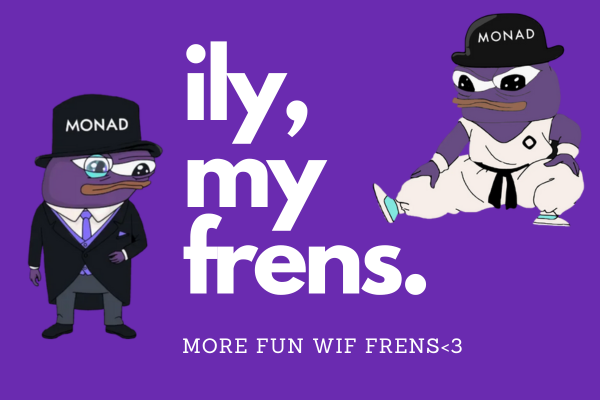

# Monad Frens 🚀

**Monad Frens** is a Farcaster MiniApp that lets you trade tokens on the Monad Blockchain, discover and connect with frens, and explore the Monad ecosystem—all in one seamless experience. 
**Miniapp link:** https://farcaster.xyz/miniapps/LOjNrsn19Dyg/monad-frens-miniapp



---

## ✨ Features

- 🔗 **Farcaster Integration:** Connect your Farcaster account and discover frens by username, wallet, or Farcaster ID.
- 💸 **Trade Tokens:** Instantly trade tokens on the Monad Blockchain with a simple, intuitive UI.
- 🧑‍🤝‍🧑 **Explore Frens:** Search, view, and connect with other Monad users.
- 🦄 **Wallet Support:** Connect your wallet and manage your assets securely.
- ⚡ **Fast & Responsive:** Built with Next.js, Tailwind CSS, and Firebase for a smooth user experience.

---

## 🚀 Getting Started

### Prerequisites

- Node.js 18+
- Yarn or npm

### Installation

```bash
git clone https://github.com/Vinhhjk/monadfrens.git
cd monadfrens
yarn install
# or
npm install
```

### Running Locally

1. Copy `.env.example` to `.env` and fill in your Firebase credentials:
    ```bash
    cp .env.example .env
    ```
2. Start the development server:
    ```bash
    yarn dev
    # or
    npm run dev
    ```
3. Visit [http://localhost:3000](http://localhost:3000) to start exploring Monad Frens!

---

## 🗂️ Project Structure

- `/app` — Next.js app directory (pages, layouts)
- `/components` — UI components (Navbar, Wallet Provider, etc.)
- `/utils` — Utility functions (Firebase config, etc.)
- `/public/images` — App images and banners
- `/hooks` — Custom React hooks (trading, order book, etc.)
- `/types` — TypeScript types

---

## 🛠️ Technologies Used

- [Next.js](https://nextjs.org/)
- [Tailwind CSS](https://tailwindcss.com/)
- [Firebase](https://firebase.google.com/)
- [Wagmi](https://wagmi.sh/) & [Farcaster Frame Connector](https://github.com/farcasterxyz/frame-wagmi-connector)
- [Monad Blockchain](https://monad.xyz/)

---

## 🤝 Contributing

Pull requests are welcome! For major changes, please open an issue first to discuss what you would like to change.

---

## 📄 License

[MIT](LICENSE)

---

> Trade wif frens. Explore Monad. WAGMI! 🚀
